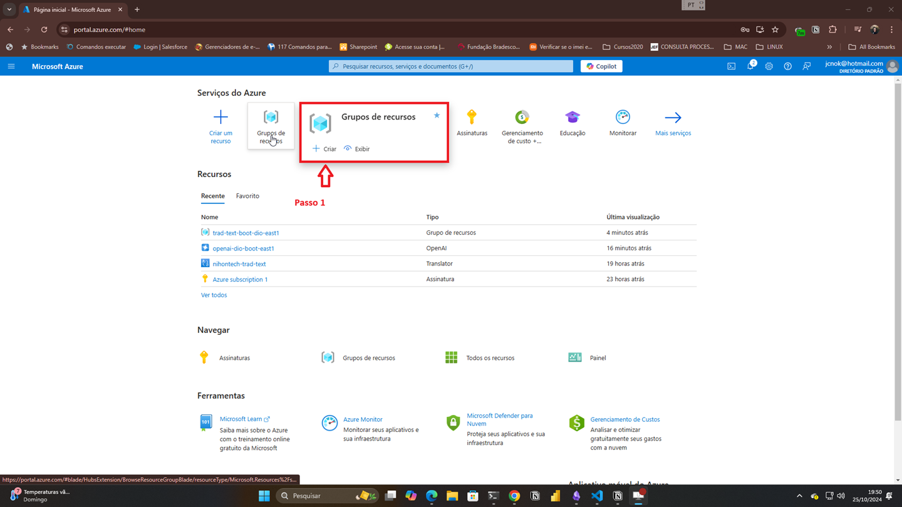
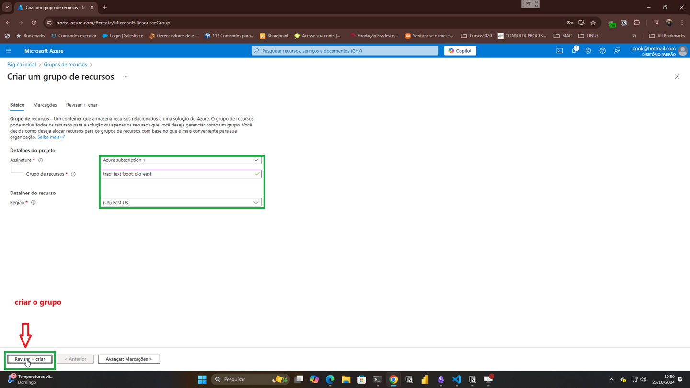
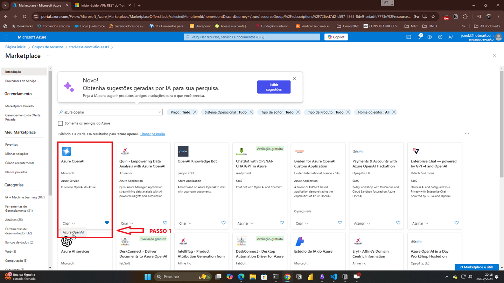
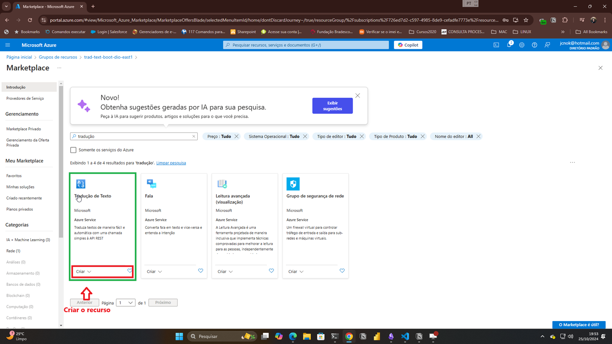

# 📚 Projeto de Tradução de Artigos Técnicos e Documentos com Azure AI


## 🗺️ Índice
- [📚 Projeto de Tradução de Artigos Técnicos e Documentos com Azure AI](#-projeto-de-tradução-de-artigos-técnicos-e-documentos-com-azure-ai)
  - [🗺️ Índice](#️-índice)
  - [📝 Introdução](#-introdução)
    - [💻 1.1 Contexto \& Problema](#-11-contexto--problema)
  - [💡 Solução](#-solução)
    - [🏗️ 2.1 Arquitetura \& Tecnologias](#️-21-arquitetura--tecnologias)
    - [✅ 2.2 Resultados \& Benefícios](#-22-resultados--benefícios)
    - [💲 2.3 Considerações de Custo](#-23-considerações-de-custo)
  - [🛠️ Passo a Passo Detalhado para o Desenvolvimento do Projeto](#️-passo-a-passo-detalhado-para-o-desenvolvimento-do-projeto)
    - [📦 3.1 Criar um Grupo de Recursos](#-31-criar-um-grupo-de-recursos)
    - [🧠 3.2 Provisionar o Serviço Azure OpenAI](#-32-provisionar-o-serviço-azure-openai)
    - [🤖 3.3 Implantar o Modelo GPT-4 Mini](#-33-implantar-o-modelo-gpt-4-mini)
    - [🌎 3.4 Provisionar o Serviço Azure Translator](#-34-provisionar-o-serviço-azure-translator)
    - [🔐 3.5 Obter a Chave de Assinatura e o Endpoint do Translator](#-35-obter-a-chave-de-assinatura-e-o-endpoint-do-translator)
  - [📰 Primeiro Projeto - Tradução de Artigos](#-primeiro-projeto---tradução-de-artigos)
    - [📚 4.1 Importar as Bibliotecas](#-41-importar-as-bibliotecas)
    - [🔐 4.2 Definir as Variáveis de Ambiente](#-42-definir-as-variáveis-de-ambiente)
    - [🔍 4.3 Criar a Função de Extração de Texto](#-43-criar-a-função-de-extração-de-texto)
    - [🌎 4.4 Criar a Função de Tradução de Texto](#-44-criar-a-função-de-tradução-de-texto)
  - [📑 Segundo Projeto - Tradução de Documentos](#-segundo-projeto---tradução-de-documentos)
    - [🌎 5.1 Criar a Função de Tradução de Texto](#-51-criar-a-função-de-tradução-de-texto)
    - [📄 5.2 Carregar um documento word para tradução](#-52-carregar-um-documento-word-para-tradução)
    - [💾 5.3 Criar uma função para salvar o arquivo traduzido no formato word](#-53-criar-uma-função-para-salvar-o-arquivo-traduzido-no-formato-word)
  - [💡 Considerações Adicionais](#-considerações-adicionais)
    - [💲 6.1 Gerenciamento de Custos](#-61-gerenciamento-de-custos)
    - [🔒 6.2 Segurança](#-62-segurança)
    - [📊 6.3 Monitoramento](#-63-monitoramento)
  - [🏁 Conclusão](#-conclusão)
    - [🔜 7.1 Próximos Passos](#-71-próximos-passos)

##  📝 Introdução

Este projeto demonstra como traduzir artigos técnicos e documentos utilizando os serviços de Inteligência Artificial (IA) da Microsoft Azure, incluindo o Azure OpenAI e o Azure Translator. O objetivo é automatizar e simplificar o processo de tradução de conteúdo técnico, tornando-o acessível a um público mais amplo.

[⬆️ voltar ao Índice](#️-índice)

### 💻 1.1 Contexto & Problema 

A tradução de artigos técnicos e documentos apresenta desafios específicos, como a necessidade de manter a precisão terminológica e o estilo formal da escrita técnica. A tradução manual é um processo demorado e dispendioso, especialmente para grandes volumes de conteúdo. Além disso, a tradução de documentos como arquivos Word pode ser um processo tedioso, exigindo a conversão manual do documento para um formato de texto antes da tradução.

Este projeto visa solucionar esse problema, oferecendo uma solução automatizada para a tradução de artigos técnicos e documentos, utilizando os serviços de IA da Azure.

[⬆️ voltar ao Índice](#️-índice)

##  💡 Solução

Este projeto apresenta uma solução que automatiza a tradução de artigos técnicos e documentos utilizando os seguintes serviços:

*   **Azure OpenAI:** Um serviço de IA que fornece modelos de linguagem avançados para tradução de texto, geração de texto e muito mais.
*   **Azure Translator:** Um serviço de tradução de texto baseado em nuvem que suporta a tradução entre vários idiomas.
*   **Python & Bibliotecas:** Linguagem de programação e bibliotecas como `requests`, `BeautifulSoup` e `docx` são usadas para interagir com os serviços da Azure e manipular os dados.

###  🏗️ 2.1 Arquitetura & Tecnologias

A solução consiste nos seguintes componentes:
* Tradutor de Artigos:
  *   **Web Scraping:** O código Python extrai o texto do artigo técnico de uma URL fornecida.
  *   **Pré-processamento de Texto:** O texto extraído é limpo e formatado para ser processado pelos serviços de IA.
  *   **Tradução:** O texto pré-processado é enviado ao serviço Azure OpenAI para tradução do texto para o idioma desejado.
  *   **Geração de Markdown:** O texto traduzido é formatado em Markdown para fácil visualização e publicação.
* Tradutor de Documentos:
  *   **Carregamento de Documentos:** O documento é carregado através da lib `docx`.
  *   **Tradução do documento:** O documento é traduzido com Azure Translator.
  *   **Tradução salva:** O texto traduzido é salvo no formato word.


[⬆️ voltar ao Índice](#️-índice)

###  ✅ 2.2 Resultados & Benefícios

A solução automatiza o processo de tradução de artigos técnicos e documentos, resultando em:

*   **Eficiência:** Tradução rápida e eficiente de grandes volumes de conteúdo.
*   **Acessibilidade:** Tradução de conteúdo técnico para vários idiomas, tornando-o acessível a um público mais amplo.
*   **Consistência:** Manutenção da precisão terminológica e do estilo formal da escrita técnica.

[⬆️ voltar ao Índice](#️-índice)

###  💲 2.3 Considerações de Custo

A utilização dos serviços Azure OpenAI e Azure Translator incorre em custos, que variam de acordo com o volume de texto traduzido. É possível utilizar a camada gratuita para volumes menores de tradução. A partir de um determinado volume, a utilização do Azure OpenAI pode ser mais econômica do que o Azure Translator.

[⬆️ voltar ao Índice](#️-índice)

##  🛠️ Passo a Passo Detalhado para o Desenvolvimento do Projeto

###  📦 3.1 Criar um Grupo de Recursos 

No portal do Azure, crie um grupo de recursos para organizar os recursos do projeto, como o Azure OpenAI e o Azure Translator.





[⬆️ voltar ao Índice](#️-índice)

###  🧠 3.2 Provisionar o Serviço Azure OpenAI

Crie uma instância do serviço Azure OpenAI. Selecione a região desejada (East por exemplo), escolha um nome para a instância, e opte pela camada gratuita para começar.




[⬆️ voltar ao Índice](#️-índice)

###  🤖 3.3 Implantar o Modelo GPT-4 Mini

No Azure OpenAI Studio, implante o modelo GPT-4 Mini, selecionando o "Modo Básico" e a opção "Standard" para a implantação. Anote a chave de API e o endpoint do Azure OpenAI, pois você precisará deles mais tarde.


[⬆️ voltar ao Índice](#️-índice)

###  🌎 3.4 Provisionar o Serviço Azure Translator

Crie uma instância do serviço Azure Translator no mesmo grupo de recursos. Escolha a região East US 2 para consistência, nomeie a instância e selecione a camada gratuita, que oferece tradução de até 2 milhões de caracteres.  

                                                            


[⬆️ voltar ao Índice](#️-índice)

###  🔐 3.5 Obter a Chave de Assinatura e o Endpoint do Translator

Acesse as chaves de assinatura e o endpoint do serviço Azure Translator. Anote essas informações, pois serão usadas para autenticar e interagir com o serviço.


[⬆️ voltar ao Índice](#️-índice)

##  📰 Primeiro Projeto - Tradução de Artigos

###  📚 4.1 Importar as Bibliotecas

```python
from bs4 import BeautifulSoup
import requests, uuid, json
import os
from dotenv import load_dotenv
```

[⬆️ voltar ao Índice](#️-índice)

###  🔐 4.2 Definir as Variáveis de Ambiente

Defina as variáveis de ambiente para a chave de assinatura do Azure Translator, endpoint do Translator e endpoint do Azure OpenAI:

```python
# Carregar variáveis de ambiente do arquivo .env
load_dotenv()

API_KEY = os.getenv("AZURE_OPENAI_KEY")
key = os.getenv("TRANSLATOR_API_KEY")
endpoint = os.getenv("TRANSLATOR_ENDPOINT")
location = os.getenv("TRANSLATOR_LOCATION")
```

[⬆️ voltar ao Índice](#️-índice)

###  🔍 4.3 Criar a Função de Extração de Texto

Crie uma função Python chamada `extract_text()` para extrair texto de uma URL fornecida. Esta função deve:

*   Usar `requests.get()` para buscar o conteúdo HTML da URL.
*   Verificar se a resposta HTTP tem o código de status 200 (sucesso).
*   Criar um objeto `BeautifulSoup` para analisar o HTML.
*   Remover tags `<script>` e `<style>` do HTML.
*   Extrair o texto usando `soup.get_text()`.
*   Limpar o texto removendo caracteres desnecessários, como quebras de linha extras.
*   Retornar o texto limpo.

```python
url="https://dev.to/eric_dequ/steve-jobs-the-visionary-who-blended-spirituality-and-technology-3ppi"
def extract_text(url):
    response = requests.get(url)
    if response.status_code == 200:
        soup = BeautifulSoup(response.text, 'html.parser')
        for script in soup(["script", "style"]):
            script.decompose()
        text = soup.get_text(" ", strip=True)
        return text
    else:
        print("Falha ao buscar a URL. Código de status:", response.status_code)
        return None
extract_text(url)
```

[⬆️ voltar ao Índice](#️-índice)

###  🌎 4.4 Criar a Função de Tradução de Texto

Crie uma função Python chamada `translate_article()` para traduzir o texto extraído usando o Azure Translator. Esta função deve:

*   Definir o endpoint da API de tradução.(ENDPOINT)
*   Criar um cabeçalho de solicitação com a chave de assinatura.(headers)
*   Definir o corpo da solicitação com o texto a ser traduzido.(payload)
*   Enviar uma solicitação POST para a API de tradução usando `requests.post()`.
*   Extrair o texto traduzido da resposta JSON.
*   Retornar o texto traduzido.

```python
def translate_article(text, lang):
    headers = {
    "Content-Type": "application/json",
    "api-key": API_KEY,
    }
    
    # Payload for the request
    payload = {
      "messages": [
        {
          "role": "system",
          "content": [
            {
              "type": "text",
              "text": "Você atua como tradutor de textos"
            }
          ]
        },
        {
          "role": "user",
          "content": [
            {
              "type": "text",
              "text": f"traduza: {text} para o idioma {lang} e responda apenas com a tradução no formato markdown"
            }
          ]
        },    
      ],
      "temperature": 0.7,
      "top_p": 0.95,
      "max_tokens": 900
    }
    
    ENDPOINT = "https://openai-dio-boot-east1.openai.azure.com/openai/deployments/gpt-4o-mini/chat/completions?api-version=2024-02-15-preview"
    
    # Send request
    try:
        response = requests.post(ENDPOINT, headers=headers, json=payload)
        response.raise_for_status()  # Will raise an HTTPError if the HTTP request returned an unsuccessful status code
    except requests.RequestException as e:
        raise SystemExit(f"Failed to make the request. Error: {e}")
    
    # Handle the response as needed (e.g., print or process)
    return (response.json()['choices'][0]['message']['content'])
```

*   **Realizando testes:**

```python
translate_article("The future belongs to those who believe in the beauty of their dreams. - Eleanor Roosevelt","português")
```

*   **Agora vamos testar com o artigo:** 'https://dev.to/eric_dequ/steve-jobs-the-visionary-who-blended-spirituality-and-technology-3ppi'

```python
url = "https://dev.to/eric_dequ/steve-jobs-the-visionary-who-blended-spirituality-and-technology-3ppi"
text = extract_text(url)
artigo = translate_article(text,"português")
print(artigo)
```

[⬆️ voltar ao Índice](#️-índice)

##  📑 Segundo Projeto - Tradução de Documentos

###  🌎 5.1 Criar a Função de Tradução de Texto

Crie uma função Python chamada `translate_text()` para traduzir o texto extraído usando o Azure Translator. Esta função deve:

*   Definir o endpoint da API de tradução como `translator_endpoint + "translate"`.
*   Criar um cabeçalho de solicitação com a chave de assinatura e um ID de cliente.(`headers`)
*   Definir o corpo da solicitação com o texto a ser traduzido, o idioma de origem (inglês) e o idioma de destino (português brasileiro).(`params, body`)
*   Enviar uma solicitação POST para a API de tradução usando `requests.post()`.
*   Extrair o texto traduzido da resposta JSON.
*   Retornar o texto traduzido.

```python
import requests, uuid, json
import os
from dotenv import load_dotenv
def translate_text(text, lang_from, lang_to):        
        # Carregar variáveis de ambiente do arquivo .env
        load_dotenv()
        
        key = os.getenv("TRANSLATOR_API_KEY")
        endpoint = os.getenv("TRANSLATOR_ENDPOINT")
        location = os.getenv("TRANSLATOR_LOCATION")
        
        path = '/translate'
        constructed_url = endpoint + path
        
        params = {
            'api-version': '3.0',
            'from': lang_from,
            'to': lang_to
        }
        
        headers = {
            'Ocp-Apim-Subscription-Key': key,
            # location required if you're using a multi-service or regional (not global) resource.
            'Ocp-Apim-Subscription-Region': location,
            'Content-type': 'application/json',
            'X-ClientTraceId': str(uuid.uuid4())
        }
        
        # You can pass more than one object in body.
        body = [{
            'text': text
        }]
        
        request = requests.post(constructed_url, params=params, headers=headers, json=body)
        response = request.json()
        return response[0]['translations'][0]['text']
```

[⬆️ voltar ao Índice](#️-índice)

###  📄 5.2 Carregar um documento word para tradução

```python
from docx import Document
def carregar_texto_word(arquivo):
    doc = Document(arquivo)
    texto_completo = "\n".join([paragrafo.text for paragrafo in doc.paragraphs])
    return texto_completo
```

[⬆️ voltar ao Índice](#️-índice)

###  💾 5.3 Criar uma função para salvar o arquivo traduzido no formato word

```python
from io import BytesIO
def trad_para_download(texto, nome_arquivo="tradução.docx"):
    doc = Document()
    for linha in texto.split('\n'):
        doc.add_paragraph(linha)    
    doc.save(nome_arquivo)    
```

[⬆️ voltar ao Índice](#️-índice)

##  💡 Considerações Adicionais

###  💲 6.1 Gerenciamento de Custos

Monitore o uso dos serviços Azure OpenAI e Azure Translator para controlar os custos. Avalie a possibilidade de utilizar a camada gratuita para projetos menores ou migrar para camadas pagas para volumes maiores.

[⬆️ voltar ao Índice](#️-índice)

###  🔒 6.2 Segurança

Utilize o Azure Key Vault para armazenar as chaves de API com segurança.

[⬆️ voltar ao Índice](#️-índice)

###  📊 6.3 Monitoramento

Implemente o monitoramento para os serviços Azure AI, incluindo alertas para eventos importantes e análise de logs para identificar e solucionar problemas.

[⬆️ voltar ao Índice](#️-índice)

##  🏁 Conclusão

Este passo a passo detalhado fornece um guia abrangente para o desenvolvimento de um projeto de tradução de artigos técnicos e documentos usando a IA do Azure. Ao combinar os serviços Azure OpenAI e Azure Translator, você pode automatizar o processo de tradução, ampliar o alcance do seu conteúdo e melhorar a acessibilidade para um público global.

###  🔜 7.1 Próximos Passos

*   Refatorar os códigos para arquivo.py;
*   Criar um frontend com streamlit para demonstração do projeto;

[⬆️ voltar ao Índice](#️-índice)

