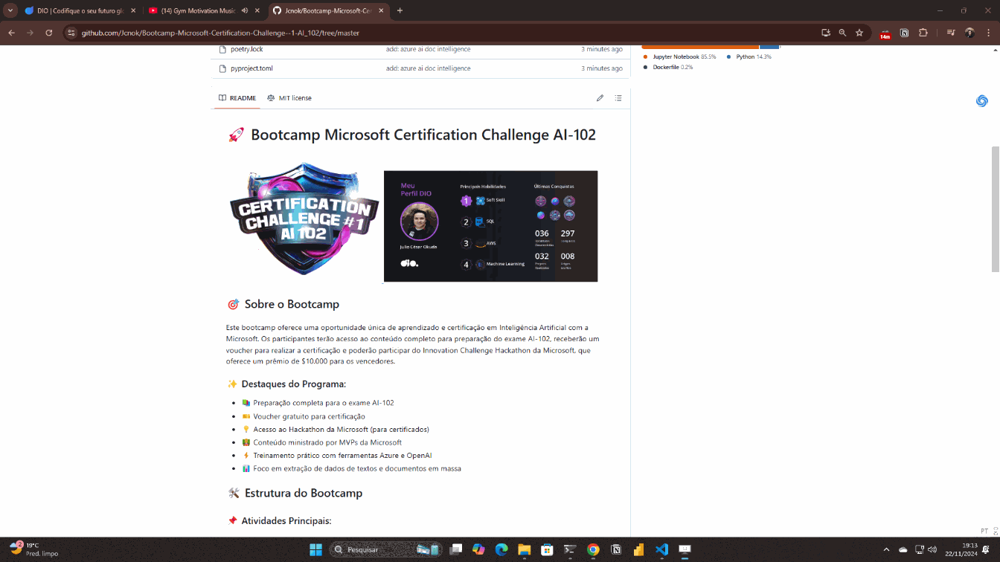

<div align="center">
  
  <h1>💳 Credit Card Analyzer</h1>
  <p>Uma solução inovadora para análise e validação de cartões de crédito utilizando Azure AI</p>
  
  
  
  
</div>

## 📁 Estrutura do Projeto
```bash
credit-card-analyzer/
├── img/               # Imagens de exemplo
├── data/               # Banco de dados SQLite
├── src/               # Código fonte
│   ├── utils/         # Utilitários e configurações
│   │   ├── Config.py
│   │   └── __init__.py
│   ├── services/      # Serviços da aplicação
│   │   ├── blob_service.py
│   │   ├── credit_card_service.py
│   │   ├── data_base.py
│   │   └── __init__.py
│   └── app.py         # Aplicação principal
├── Dockerfile         # Configuração do container
├── docker-compose.yml # Configuração do Docker Compose
├── requirements.txt   # Dependências do projeto
└── README.md         # Este arquivo
```

## 📑 Índice

- [📁 Estrutura do Projeto](#-estrutura-do-projeto)
- [📑 Índice](#-índice)
- [📋 Sobre o Projeto](#-sobre-o-projeto)
- [🚀 Tecnologias Utilizadas](#-tecnologias-utilizadas)
- [📦 Requisitos](#-requisitos)
- [⚙️ Instalação e Execução](#️-instalação-e-execução)
  - [💻 Execução Local](#-execução-local)
  - [🐳 Execução com Docker](#-execução-com-docker)
- [🎯 Funcionalidades](#-funcionalidades)
- [📈 Próximos Passos](#-próximos-passos)

## 📋 Sobre o Projeto
[🔝 Voltar ao índice](#-índice)

O Credit Card Analyzer é uma aplicação web moderna que simplifica o processo de validação de cartões de crédito em plataformas de e-commerce. Utilizando a avançada Inteligência Artificial da Azure, o sistema é capaz de extrair e validar informações de cartões de crédito a partir de imagens, proporcionando uma experiência simples e eficiente.

## 🚀 Tecnologias Utilizadas
[🔝 Voltar ao índice](#-índice)

**Core:**
- Python 3.12+
- Streamlit 1.39.0+
- Azure Document Intelligence
- Azure Blob Storage
- SQLite

**Bibliotecas Principais:**
- `azure-ai-documentintelligence`: Análise de documentos
- `azure-storage-blob`: Armazenamento de imagens
- `pandas`: Manipulação de dados
- `python-dotenv`: Gerenciamento de variáveis de ambiente

## 📦 Requisitos
[🔝 Voltar ao índice](#-índice)

- Python 3.12 ou superior
- Conta Azure com acesso aos serviços:
  - Azure Document Intelligence
  - Azure Blob Storage
- Docker (opcional)

## ⚙️ Instalação e Execução

### 💻 Execução Local
[🔝 Voltar ao índice](#-índice)



1. Clone o repositório:
```bash
git clone https://github.com/Jcnok/Bootcamp-Microsoft-Certification-Challenge--1-AI_102.git
```

2. Navegue até a pasta do repositório:
```bash
cd Bootcamp-Microsoft-Certification-Challenge--1-AI_102
```
3. Instale o Poetry (caso não tenha):
```bash
curl -sSL https://install.python-poetry.org | python3 -
```
4. Configure o ambiente virtual e instale as dependências:
```bash
poetry install --without dev 
```
5. Acessa o ambiente virtual:
```bash
poetry shell
```

6. Configure as variáveis de ambiente:
```bash
cp .env.example .env
```

7. Edite o arquivo `.env` com suas credenciais:
```env
AZURE_DOC_INT_ENDPOINT=seu_endpoint_doc_intelligence
AZURE_DOC_INT_KEY=sua_chave_doc_intelligence
AZURE_STORAGE_CONNECTION=sua_connection_string_storage
CONTAINER_NAME=seu_container_name
DATABASE_PATH=../data/credit_cards.db
```
* **Caso tenha dificuldades fiz um guia de como obter as credenciais aqui:[guia passo a passo](https://github.com/Jcnok/Bootcamp-Microsoft-Certification-Challenge--1-AI_102/blob/master/desafios_de_projeto/desafio_2/azure_services_guide.md)**
  
8. Acesse o diretório do projeto:
```bash
cd desafios_de_projeto/desafio_2/src
```   
9. Execute a aplicação:
```bash
streamlit run app.py
```
10. Acesse: http://localhost:8501


### 🐳 Execução com Docker
[🔝 Voltar ao índice](#-índice)

1. Acesse a pasta onde o arquivo `Dockerfile` está localizado:
```bash
cd desafios_de_projeto/desafio_2/src 
```

2. Build e execução:
```bash
docker-compose up --build
```

3. Acesse: http://localhost:8501

4. Para parar:
```bash
docker-compose down
```

## 🎯 Funcionalidades
[🔝 Voltar ao índice](#-índice)

- **Análise de Cartões:**
  - Upload de imagens de cartões
  - Extração automática de dados
  - Validação do cartão
  - Armazenamento em banco de dados

- **Consulta de Dados:**
  - Filtros personalizados
  - Exportação para CSV
  - Visualização detalhada

- **Interface Intuitiva:**
  - Design responsivo
  - Feedback visual
  - Navegação simplificada

## 📈 Próximos Passos
[🔝 Voltar ao índice](#-índice)

- Implementação de segurança visando a proteção de dados LGPD
- Validação robusta, como verificaçã da data de validade etc...
- Suporte a múltiplos idiomas
- Dashboard analítico avançado
- API REST para integrações

---

<div align="center">
  <p>Desenvolvido por Julio Okuda com ❤️ e ☕</p>
  <p>
    <a href="https://www.linkedin.com/in/juliookuda/">LinkedIn</a> •
    <a href="https://github.com/Jcnok">GitHub</a>
  </p>
</div>
