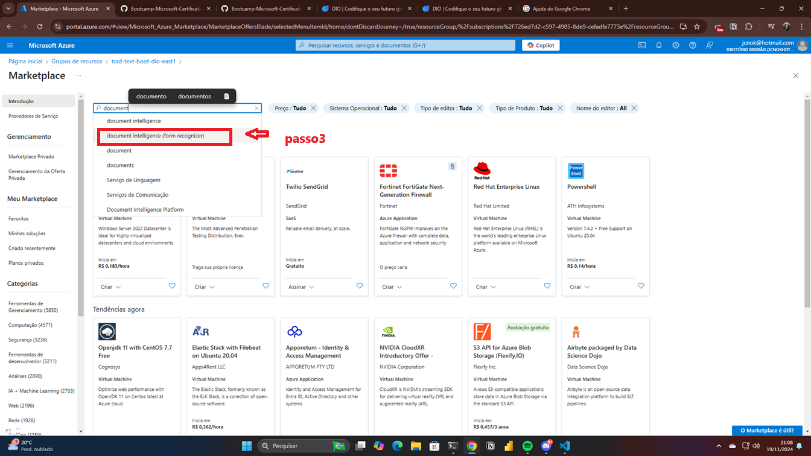
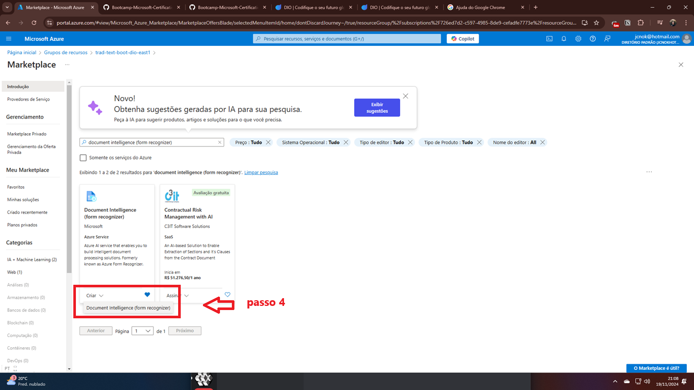
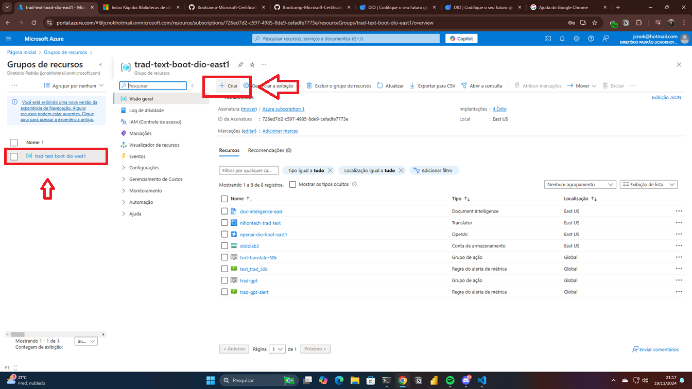
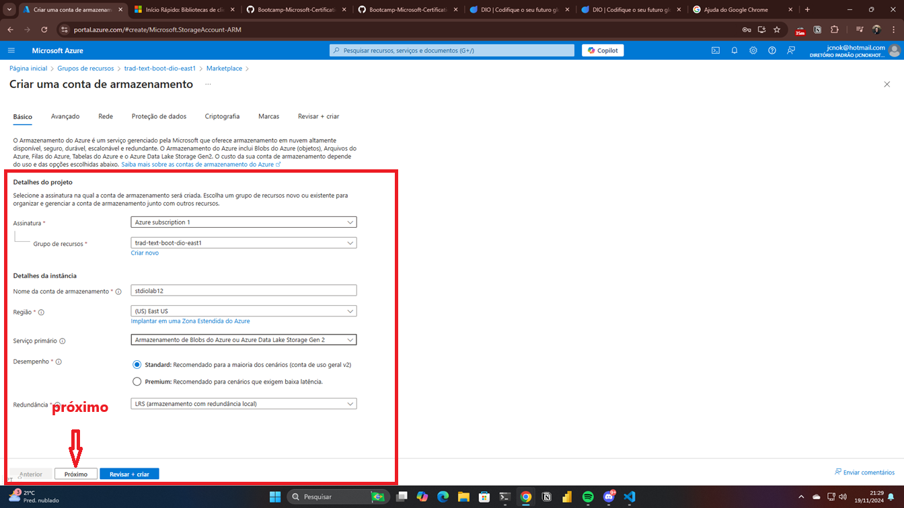
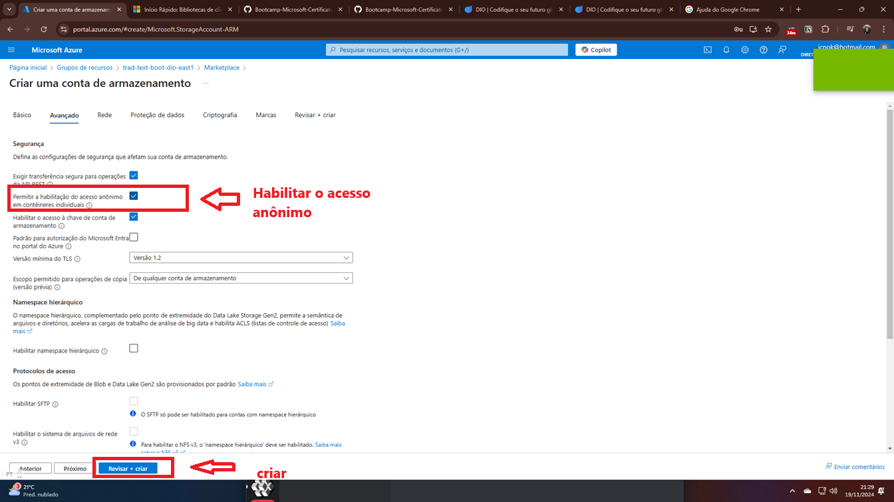

# Obtendo Credenciais do Azure para o desafio2, Análise anti-fraude : Um Guia Passo a Passo
## 🚀 Bootcamp Microsoft Certification Challenge AI-102

### Este guia prático ajudará você a configurar os recursos do Azure necessários para o projeto do Bootcamp Microsoft Certification Challenge AI-102, especialmente para aqueles que estão enfrentando dificuldades para obter as credenciais e configurar o ambiente. Abordaremos a criação de um grupo de recursos, a configuração do serviço Document Intelligence e do serviço Storage, fornecendo um passo a passo detalhado e ilustrado.

### Recursos Necessários:

**Para acompanhar este guia, você precisará de:**

* Uma conta ativa do Azure. Se você ainda não tem uma, pode criar uma conta gratuita.

**Variáveis de Ambiente (.env):**

As seguintes variáveis de ambiente precisarão ser configuradas no seu arquivo `.env` após a conclusão deste guia:

* `AZURE_DOC_INT_ENDPOINT` -> O endpoint do seu recurso Document Intelligence.
* `AZURE_DOC_INT_KEY`-> A chave do seu recurso Document Intelligence.
* `AZURE_STORAGE_CONNECTION`-> A string de conexão do seu recurso Storage.
* `CONTAINER_NAME`-> O nome do contêiner que você criará no Storage.

### Passo1: Criar um grupo de recursos

O primeiro passo é criar um grupo de recursos. Grupos de recursos são uma forma de organizar os serviços que você utiliza no Azure. Isso facilita o gerenciamento, o controle de custos e a exclusão de recursos quando não são mais necessários.

* **No portal do Azure, pesquise por "Grupos de recursos" e selecione a opção correspondente.**
* **Clique em "+ Criar".**
* **Escolha uma assinatura. Se você estiver usando uma assinatura gratuita ou de bootcamp, selecione-a aqui.**
* **Dê um nome ao seu grupo de recursos (ex: BootcampAI102-RG). Escolha uma região para o grupo de recursos (idealmente a mais próxima de você).**
* **Clique em "Examinar + criar" para validar as configurações.**
* **Finalmente, clique em "Criar" para criar o grupo de recursos.**


### Passo2: Configurando o Document Intelligence.
O Document Intelligence é o serviço que utilizaremos para extrair informações dos cartões de crédito. Para utilizá-lo, precisamos criar um recurso e obter suas credenciais.

* **No portal do Azure, pesquise por "Document Intelligence" ou "Form Recognizer" e selecione a opção correspondente.**
* **Clique em "+ Criar".**



* **Escolha a assinatura e o grupo de recursos que você criou no passo anterior (BootcampAI102-RG).**
* **Dê um nome ao seu recurso (ex: BootcampAI102-DocInt). Escolha a região (deve ser a mesma do grupo de recursos).**
* **No campo "Tipo de preço", escolha o nível que se adapta às suas necessidades. O nível gratuito (F0) pode ser suficiente para este projeto.**
* **Clique em "Examinar + criar" para validar as configurações.**
* **Clique em "Criar" para criar o recurso.**


* **Após a criação do recurso, acesse-o no portal do Azure.**
* **No menu lateral, em "Gerenciamento de recursos", clique em "Chaves e Endpoint".**
* **Copie o valor do "Endpoint" e cole-o no seu arquivo .env como AZURE_DOC_INT_ENDPOINT.**
* **Copie a "Chave 1" (ou "Chave 2") e cole-a no seu arquivo .env como AZURE_DOC_INT_KEY.**
* 


### Passo3: No mesmo grupo de recursos criar o serviço de storage: 
O Blob Storage será usado para armazenar as imagens dos cartões de crédito.

* **No portal do Azure, pesquise por "Contas de Armazenamento" e selecione a opção correspondente.**
* **Clique em "+ Criar".** 
  



* **Escolha a assinatura e o grupo de recursos que você criou no primeiro passo (BootcampAI102-RG).**
* **Dê um nome à sua conta de armazenamento (ex: bootcampai102storage). Escolha a região (deve ser a mesma do grupo de recursos).**
* **Na aba "Avançado", certifique-se de que a opção "Hierarquia de contas" esteja definida como "StorageV2 (uso geral v2)".**
* **Deixe as outras configurações como padrão e clique em "Examinar + criar".**
* **Clique em "Criar" para criar a conta de armazenamento.**




**Criando um Contêiner:**

* **Após a criação da conta de armazenamento, acesse-a no portal do Azure.**
* **No menu lateral, em "Armazenamento de dados", clique em "Contêineres".**
* **Clique em "+ Contêiner".**
* **Dê um nome ao contêiner (ex: cartoes) e defina o nível de acesso público como "Acesso anônimo somente leitura de blobs" ou "Privado (sem acesso anônimo)" dependendo das suas necessidades.**
* **Clique em "Criar".**


**Obtendo a String de Conexão do Storage:**

* **Na sua conta de armazenamento, no menu lateral, em "Configurações", clique em "Chaves de acesso".**
* **Copie a "String de conexão" da "key1" (ou "key2").**
* **Cole esta string no seu arquivo .env como AZURE_STORAGE_CONNECTION.**


### Passo 4: Configurando o arquivo .env

**Com todas as informações em mãos, abra o arquivo .env na raiz do seu projeto e preencha as variáveis com as informações copiadas do portal do Azure:**

```bash
AZURE_DOC_INT_ENDPOINT -> Document Intelligence endpoint
AZURE_DOC_INT_KEY-> Document Intelligence key
AZURE_STORAGE_CONNECTION-> Storage connection string
CONTAINER_NAME-> Container name
```


